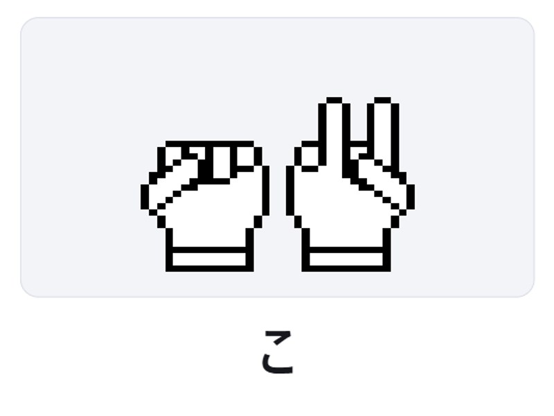

# Digital Finger Spelling（デジタル指話）

Digital Finger Spelling（デジタル指話）は、日本語の 50 音を二進数に変換し、
両手の指の状態として視覚的に表現するシステムです。

## Example: こんにちは

  

各フレームは日本語の 1 文字を、指の二進数表現として示しています。

## Concept

- 日本語 50 音を 1 〜 50 の整数に対応付け
- 数値を二進数に変換
- 各ビットを指（左右の手・各指）に割り当てて表現
- 小指どうしが中央で接触し、親指は外側に配置される構えを採用

## Bit Allocation

- Right hand (lower bits): 1 / 2 / 4 / 8 / 16
- Left hand (upper bits): 32 / 64 / 128 / 256 / 512

## GitHub Pages で公開する方法

このリポジトリには、`main` ブランチへの push をトリガーに GitHub Pages へ自動デプロイする Workflow（`.github/workflows/deploy-pages.yml`）を追加しています。

### 1. リポジトリ側で Pages を有効化

1. GitHub のリポジトリ画面で **Settings → Pages** を開く
2. **Build and deployment** の **Source** を **GitHub Actions** に設定

### 2. `main` にマージする

- `main` ブランチに変更が入ると自動でデプロイされます
- Actions タブで `Deploy static site to GitHub Pages` が成功すれば公開完了です

### 3. 公開 URL

通常は以下の URL で公開されます。

- `https://<ユーザー名>.github.io/<リポジトリ名>/`

## Status

🚧 Work in progress
This repository currently contains an experimental web-based visualizer.

## License

MIT License
